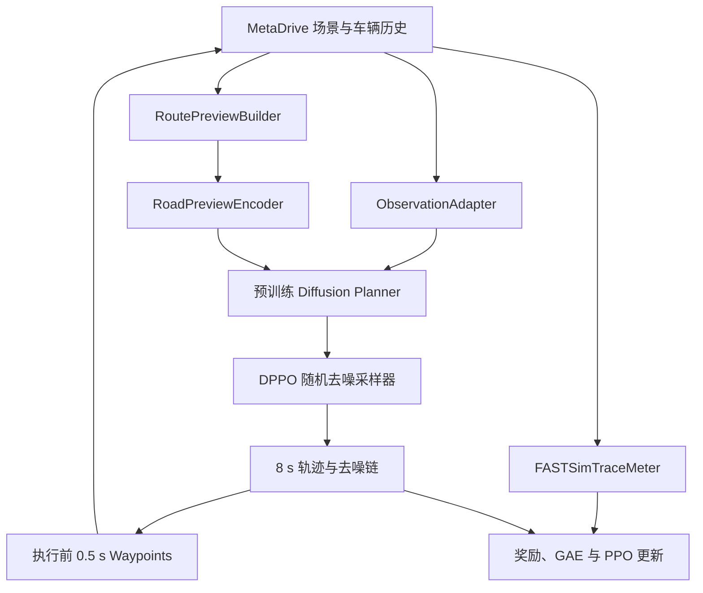

# Diffusion Planner 能耗强化学习微调总体方案

> 状态：总体设计 v0.1（用于后续逐步实现）  
> 日期：2026-08-02

## 1. 总体路线

本项目采用“**保留 Diffusion Planner 预训练主体 + 新增 MetaDrive 适配层 + 新增 DPPO 随机采样器 + FASTSim 能耗计量**”的路线。

最小可行系统分为两条链：

1. **闭环执行链**：MetaDrive 场景 → 向量化观测与道路预瞄 → Diffusion Planner 生成 8 s 轨迹 → 执行前 0.5 s → 再规划。
2. **强化学习链**：记录扩散去噪链及逐步 log-prob → 收集 MetaDrive 奖励和 FASTSim 能耗 → GAE → PPO 更新可训练参数与 critic。

关键技术判断如下：

- Diffusion Planner 当前推理使用 `no_grad` 的 10 步 DPM-Solver++。它不产生 DPPO 所需的逐步随机转移概率，因此必须新增一个 **DPPO-compatible stochastic sampler**；预训练的连续时间 `x_start` 预测器可以继续使用。
- Diffusion Planner 固定输出 80 个未来点（8 s、10 Hz），与 MetaDrive 默认约 0.1 s 的决策间隔天然匹配。第一阶段直接使用 MetaDrive 的 `WaypointPolicy` 执行局部轨迹，不单独建立动力学模型。
- 不把超过原训练分布的远期路线直接塞进现有 `route_lanes`。应新增零初始化的 `RoadPreviewEncoder`，以残差方式注入 200–500 m 的道路预瞄信息，最大程度保留开源权重的初始行为。
- RL 主循环使用 **Lightning Fabric**。Fabric 保留自定义 PPO 循环，同时提供设备、混合精度、DDP、日志和 checkpoint 封装；若进行离线行为克隆预热，可单独使用标准 Lightning Trainer。
- FASTSim 是后向整车能耗模型，输入至少需要时间—速度序列，不加入坡度。第一阶段的能耗改进主要来自速度规划、减少无效加减速和交通交互，而不是坡度预瞄。

## 2. 研究边界与默认值

| 项目 | 推荐默认值 | 原因 |
| --- | --- | --- |
| 车辆 | FASTSim 自带 `2012_Ford_Fusion.yaml`，传统燃油乘用车 | 自带资源、普通家用车、累计燃油能量定义清楚 |
| 模拟地图 | MetaDrive 程序化单智能体环境，响应式交通 | 易生成大量训练场景，适合闭环 RL |
| 规划频率 | 2 Hz，即每 0.5 s 重规划 | 计算量和闭环反馈之间较平衡 |
| 仿真频率 | 10 Hz | 与 Diffusion Planner 80 点 / 8 s 对齐 |
| 规划输出 | 8 s 完整轨迹，实际执行前 5 点 | 保持开源权重输出维度与滚动规划方式 |
| 扩散步数 | 保留训练定义；RL 初期仅微调最后 1–2 个去噪步，逐步升到 5 | 降低遗忘和训练成本 |
| 可训练范围 | 预瞄编码器 + decoder LoRA/最后一层 + critic | 尽量保留原有安全与驾驶能力 |
| 训练环境长度 | 先 20–60 s，再逐步增加 | 先降低长时域信用分配难度 |
| 长距离评价 | 固定路线 2–5 km 起步，之后扩展至 10 km 级 | 程序化超长地图需要先验证生成稳定性 |

“长距离”的最终公里数、车辆动力类型和是否需要交通灯应在基线打通后再锁定，不影响当前架构。

## 3. 总体架构



系统应明确分开四类状态：

- `sim_state`：MetaDrive 的真实闭环状态；
- `model_obs`：严格匹配 Diffusion Planner 预训练输入的数据；
- `diffusion_chain`：每次规划的去噪中间状态、时间步、均值、方差与 log-prob；
- `energy_state`：本回合累计的时间、实际速度、坡度和 FASTSim 累计能耗。

## 4. MetaDrive 与 Diffusion Planner 的接口

### 4.1 观测适配器

`MetaDriveObservationAdapter` 不使用 MetaDrive 默认的低维 lidar observation，而是直接从仿真对象和地图 API 构造 Diffusion Planner 所需字典。

| Diffusion Planner 输入 | 目标形状（默认） | MetaDrive 来源与处理 |
| --- | --- | --- |
| `ego_current_state` | `[B, 10]` | ego 位置、朝向、速度、加速度等；变换到 ego 局部坐标 |
| `neighbor_agents_past` | `[B, 32, 21, 11]` | 周车 2 s 历史；按距离筛选、补零、带类型编码 |
| `static_objects` | `[B, 5, 10]` | 路障等静态对象；无对象时补零 |
| `lanes` | `[B, 70, 20, 12]` | 100 m 邻域内车道中心线、左右边界、信号编码 |
| `lanes_speed_limit` | `[B, 70, 1]` | `lane.speed_limit`，未知时显式标记 |
| `lanes_has_speed_limit` | `[B, 70, 1]` | 布尔掩码 |
| `route_lanes` | `[B, 25, 20, 12]` | navigation 最短路径上的车道序列 |
| route speed-limit 字段 | 与 lane 对齐 | 沿 route lane 查询 |

必须加入以下适配测试：

1. ego 原点、前向 x 轴和左右手坐标系检查；
2. MetaDrive 车辆中心到 nuPlan 风格后轴中心的偏移检查；
3. 车道中心线、边界和 heading 的可视化叠加检查；
4. 相同物理场景在全局平移/旋转后，局部输入保持一致；
5. 输入归一化后各通道分布与原 `normalization.json` 的量级一致。

### 4.2 道路预瞄

现有模型已经接收约 100 m 内的局部车道和 route lanes，但能耗规划需要更长的预瞄。新增 `RoutePreviewBuilder`，沿导航路线按弧长采样，例如：

- 距离位置：`0, 10, 20, ..., 300 m`；
- 曲率及曲率变化；
- 速度限制；
- 到下一个交叉口、并道、分流或停止点的距离；
- 车道数或可行车道变化；
- 坡度（MetaDrive 平面图第一阶段固定为 0，并保留字段）；
- 可选的信号状态及估计剩余时间（仅当环境可靠提供时启用）。

`RoadPreviewEncoder` 使用小型 1D Transformer 或 MLP-Mixer，将预瞄序列编码为一个 context token，通过零初始化投影加到 DiT 的条件向量 `y`。零初始化保证加载原权重时策略行为近似不变。

### 4.3 轨迹执行

第一阶段使用 MetaDrive 自带 `WaypointPolicy`：模型输出局部 `(x, y)` 轨迹，转成世界坐标，环境按 0.1 s 更新位置、速度、heading 和角速度。每次只执行前 5 点，其余点作为规划上下文但不执行。

这一路线不额外引入车辆动力学模型，开发量最小。但它属于轨迹级/运动学闭环，并不等价于低层转向、油门、制动闭环。后续如需研究可执行性，只替换 `TrajectoryExecutor` 为 PID / Stanley / MPC 跟踪器，不改模型和 RL 接口。

## 5. DPPO 改造

### 5.1 为什么不能直接复用原采样器

原 Diffusion Planner 的推理函数调用 10 步 DPM-Solver++，并包在 `torch.no_grad()` 中。DPPO 则把去噪过程视为内层 MDP，需要每一步满足可计算的高斯转移：

\[
x_{k-1} \sim \mathcal{N}\bigl(\mu_\theta(x_k, c, k),\;\sigma_k^2 I\bigr),
\]

从而能计算每一步的 `log πθ(x_{k-1}|x_k,c)` 和 PPO probability ratio。

因此新增 `DPPOTrajectorySampler`：

- 复用原模型的 continuous-time `x_start` 预测；
- 选择离散的 VP 时间表，把 `x_start` 转换为每一步反向转移均值；
- 保留可控的最小采样方差与 log-prob 方差；
- 返回最终轨迹和完整 `K+1` 去噪链；
- 强制每一步的当前状态点不变，延续原模型 initial-state constraint；
- 训练和评估均显式选择 stochastic 或 deterministic 模式。

原 DPM-Solver++ 仍保留，作为“开源基线推理”和最终性能对照。

### 5.2 动作与 log-prob 范围

外层环境动作定义为模型生成的 ego 未来轨迹。参考 DPPO 的实现，只让实际执行的前 5 个轨迹点参与 PPO log-prob 聚合；未执行的远期点继续辅助生成连贯规划，但不直接承担当步奖励梯度。

初期建议仅优化 ego token；周车未来轨迹保持为冻结的辅助预测。实现上优先采用：

1. 冻结 encoder 和基础 DiT；
2. 在 decoder 添加只作用于 ego 输出的低秩残差 adapter；
3. 周车输出完全走基础网络；
4. PPO log-prob 只计算 ego、前 5 个轨迹点。

如果 ego-only adapter 不能提供足够能力，再逐步解冻最后一个 DiT block。不要在第一版直接全量更新 joint prediction 网络，否则能耗奖励可能破坏周车预测，并导致灾难性遗忘。

### 5.3 Actor、critic 与损失

Actor 为“冻结的基础 Diffusion Planner + 可训练 preview/adapter”。Critic 单独使用：

- 冻结场景 encoder 的 pooled feature；
- road-preview feature；
- ego 当前速度、加速度、路线完成度；
- 可选的累计时间和累计能耗归一化量。

总损失：

\[
L = L_{PPO} + c_v L_V + c_{BC}L_{anchor} + c_{smooth}L_{smooth}.
\]

- `L_PPO`：按环境步和微调去噪步采样的 clipped PPO loss；
- `L_V`：value regression；
- `L_anchor`：对冻结基准策略的去噪输出或轨迹 KL/BC 约束；
- `L_smooth`：可选的轨迹连续性正则，只作为小权重稳定项。

DPPO 初始超参数不要直接照搬机器人任务，建议从以下量级起步后实测：

| 参数 | 初始值 |
| --- | --- |
| `gamma_env` | `0.99–0.995` |
| `gae_lambda` | `0.95` |
| `gamma_denoising` | `0.99` |
| PPO clip | `0.005–0.01` |
| actor LR | `1e-5–5e-5`（adapter） |
| critic LR | `3e-4` |
| update epochs | `3–5` |
| target KL | 先监控后设阈值 |
| min sampling std | 从 `0.05–0.1` 扫描 |

## 6. FASTSim 能耗奖励

### 6.1 统一能耗接口

`FastSimTraceMeter` 只接收 MetaDrive 实际执行结果，而不是模型计划值：

```text
append(time_s, achieved_speed_mps, grade)
energy_joules() -> cumulative energy
distance_meters() -> cumulative distance
```

在每个回合结束时，使用完整实际速度轨迹构造 FASTSim `Cycle`，再用固定的 `Vehicle` 和 `SimDrive` 计算累计燃油能量。这样评测口径与规划模型、控制器实现解耦。

训练阶段先采用最简单且一致的精确方案：每隔 2–5 s 用“从回合起点到当前时刻的完整前缀”运行一次 FASTSim，以本次与上次累计能耗之差作为区间能耗。该方法会重复计算，但避免短片段重置发动机/功率系统状态造成的偏差。只有实测确认 FASTSim 成为吞吐瓶颈后，再增加由 FASTSim 样本蒸馏得到的 `(v, a, grade) → energy_rate` 查表近似；最终评价始终使用完整 FASTSim。

若以后改为 HEV/BEV，需要固定初始 SOC，并谨慎使用 `walk()` 的 SOC 校正行为；训练增量口径更适合固定状态的 `walk_once()`。第一阶段选择传统燃油车可以避免这一复杂性。

### 6.2 奖励设计

不能只奖励低能耗，否则停车是最优策略。建议将研究目标表述为：

> 在满足到达、安全和旅行时间约束的前提下，最小化单位距离能耗。

训练时使用标量奖励：

\[
r_t = w_p\Delta s_t - w_E\frac{\Delta E_t}{E_{ref}}
      - w_T\Delta t - w_c C_t - w_o O_t - w_j J_t + r_{terminal}.
\]

其中：

- `Δs`：沿路线进度；
- `ΔE`：FASTSim 区间能耗；
- `Δt`：时间成本，防止极慢行驶；
- `C`：碰撞；
- `O`：驶出道路、逆行或严重偏离路线；
- `J`：加速度/jerk 舒适性小惩罚；
- `r_terminal`：到达奖励或失败惩罚。

推荐分两步调权重：先在 `w_E=0` 时确保 RL 不降低安全和完成率，再逐步提高 `w_E`。奖励原始分量必须分别记录，不能只记录总 reward。

## 7. 训练与评测场景

### 7.1 训练课程

1. **短直路和缓弯**：低交通，验证坐标、采样器、奖励方向；
2. **3–8 个 block**：加入弯道、交叉口、并道与中等交通；
3. **8–20 个 block**：增加路线长度和交通密度；
4. **20–40 个 block 或固定长序列**：只在前面阶段稳定后启用。

MetaDrive 支持按 block 数随机生成地图，也支持用 `S/C/r/R/O/X/y/Y/T...` 指定 block sequence。训练集和测试集必须使用不重叠 seed；固定测试路线还应保存生成配置，避免版本变化导致地图漂移。

程序化地图过长时可能出现生成失败或自交约束。若 5–10 km 单图不稳定，优先构建自定义长走廊地图；“跨多个短回合拼接能耗”只作为辅助统计，不应冒充连续闭环长距离测试。

### 7.2 对照组

至少保留：

1. 开源权重 + 原始 DPM-Solver++；
2. 开源权重 + DPPO sampler，但未训练；
3. 可选 MetaDrive 行为克隆/domain alignment 后、未做能耗 RL；
4. DPPO，`w_E=0`；
5. DPPO，启用能耗奖励；
6. IDM 或 MetaDrive 默认策略，作为环境参考而非同类模型主基线。

建议消融：无远期预瞄 / 100 m / 300 m；微调 1/2/5 个去噪步；adapter / 最后一块 / 全 decoder；不同交通密度。

### 7.3 长距离核心指标

安全和任务指标：

- route completion、到达率；
- collision / km、out-of-road / km；
- 旅行时间、平均速度、停车时间；
- jerk、横向加速度、规划连续性。

能耗指标：

- 总能耗和 `MJ/100 km`；
- 若为燃油车，`L/100 km` 或 MPGe；
- 单位有效进度能耗；
- 正牵引、制动和怠速能耗分解（FASTSim 能提供时）；
- 与原始策略在同 seed、同交通配置下的相对节能率。

统计时采用 paired seeds；报告均值、中位数和 bootstrap 置信区间。主要能耗结论只在“成功且旅行时间不超过基线容许范围”的回合上比较，同时另报全体回合的失败率，防止用牺牲任务完成来换节能。

## 8. 实施阶段与验收门槛

### 阶段 0：可复现基线

- 下载并正确加载官方 `args.json`、`model.pth` 的 EMA 权重；
- 使用固定合成观测和显式初始噪声，在独立 checkpoint-compatible 推理实现上确认输出正常；
- 记录 checkpoint 哈希和上游 commit。

验收：EMA 权重严格加载，10 步 DPM-Solver++ 输出 `[B, 11, 80, 4]` 且无 NaN；相同输入和噪声重复推理一致。本阶段不安装 nuPlan、不复现官方闭环分数。

### 阶段 1：MetaDrive 闭环适配

- 完成 observation、route、agent-history adapter；
- 接入原 DPM-Solver++ 和 `WaypointPolicy`；
- 输出视频和向量地图叠加图；
- 运行短回合并记录实际速度轨迹。

验收：无交通简单路线高完成率；坐标和地图单元测试通过。

### 阶段 2：FASTSim 评测闭环

- 完成完整轨迹到 FASTSim Cycle 的转换；
- 实现基准策略能耗、距离和时间统计；
- 对相同 trace 重复运行，结果完全一致。

验收：能耗随速度/加速度的基本趋势合理；基准结果可复现。

### 阶段 3：DPPO sampler 单元验证

- 实现随机去噪链、transition mean/std、log-prob；
- 固定噪声时可复现；
- old/new policy 相同时 ratio 约为 1；
- 与原 DPM 采样的轨迹分布和闭环性能做偏差检查。

验收：不训练时 sampler 不导致大幅安全退化，PPO 数值测试通过。

### 阶段 4：安全保持的 RL

- 先令 `w_E=0`；
- 训练 critic 和少量 adapter；
- 加入 base-policy anchor；
- 调整 rollout 数、采样方差和 KL。

验收：完成率和碰撞率不差于 DPPO-sampler 未训练基线的预设容差。

### 阶段 5：能耗优化与预瞄

- 启用能耗权重；
- 逐步增加 preview 距离和场景长度；
- 完成 paired-seed 消融。

验收：在成功率、旅行时间和安全约束内，单位距离能耗出现稳定、统计显著的下降。

## 9. 推荐项目结构

```text
eco-diffusion-planner/
├── pyproject.toml
├── uv.lock
├── README.md
├── configs/
│   ├── env/
│   ├── model/
│   ├── reward/
│   ├── train/
│   └── experiment/
├── docker/
│   ├── Dockerfile
│   └── compose.yaml
├── src/eco_planner/
│   ├── models/
│   │   ├── pretrained.py
│   │   ├── preview_encoder.py
│   │   ├── dppo_sampler.py
│   │   └── critic.py
│   ├── envs/
│   │   ├── metadrive_env.py
│   │   ├── observation_adapter.py
│   │   ├── route_preview.py
│   │   └── trajectory_executor.py
│   ├── energy/
│   │   ├── fastsim_meter.py
│   │   └── cycle.py
│   ├── rl/
│   │   ├── rollout.py
│   │   ├── buffer.py
│   │   ├── gae.py
│   │   └── ppo.py
│   ├── train.py
│   └── evaluate.py
├── tests/
│   ├── conftest.py
│   ├── unit/
│   ├── integration/
│   └── smoke/
├── scripts/
└── third_party/
    └── Diffusion-Planner/   # 固定 commit，只读或 submodule
```

建议将 DPPO 作为算法参考并移植最少的 log-prob、PPO loss 和 rollout 逻辑，不把整个机器人任务代码库作为运行时依赖。

## 10. 工具链与运行方式

- Python 3.10：兼容当前 FASTSim 支持范围，同时比继续绑定原仓库 Python 3.9 更合适；新项目尽量不依赖完整 nuPlan devkit。
- `uv + pyproject.toml`：依赖和锁文件；避免 Conda、pip、多套 requirements 并存。
- Hydra/OmegaConf：实验配置与命令行覆盖。
- Lightning Fabric：GPU、AMP、DDP、checkpoint、seed 和 logger。
- TensorBoard 默认；W&B 可选，不作为必需依赖。
- Gymnasium：环境接口。
- pytest + ruff：只保留快速测试和格式检查，不引入重型工程流程。

Docker 使用 Ubuntu + CUDA runtime。训练时关闭渲染和图像传感器；MetaDrive 每个进程只创建一个环境实例，因此 CPU 并行环境应采用 `spawn` 多进程，每个 worker 一个 MetaDrive。第一版先单 GPU、多 CPU rollout worker；不要一开始就做多节点。

Windows 主机只负责编辑、配置和小型静态测试；所有依赖解析、锁文件生成和正式测试都以 Ubuntu Docker 为准，避免 Panda3D、CUDA 和编译依赖在两套系统间漂移。

## 11. 主要风险与处理

| 风险 | 影响 | 处理 |
| --- | --- | --- |
| nuPlan → MetaDrive 域偏移 | 官方权重闭环失败 | 先做 adapter 可视化；必要时用 IDM/规则轨迹做短暂 BC 对齐 |
| DPM-Solver → 随机 sampler 分布偏移 | 未训练策略先退化 | 少步、低方差、只微调后段去噪；保留原 sampler 对照 |
| 高维轨迹 PPO ratio 不稳 | clip 率高、梯度消失 | 只聚合已执行的 ego 前缀，按维均值，采用 DPPO 的小 clip 和 KL 早停 |
| 能耗奖励诱导慢行/停车 | 虚假节能 | 进度、时间、到达约束；成功回合内比较能耗 |
| waypoint 执行绕开动力学 | 结果不可直接部署 | 明确研究边界；后续只替换 executor 做可执行性扩展 |
| FASTSim 在线重复计算慢 | rollout 吞吐下降 | 先 profile 前缀法；必要时使用 FASTSim 蒸馏查表，最终评测保持精确 |
| 程序化超长地图生成不稳 | 长距离评测不足 | 固定长序列、自定义长走廊；不要用不连续回合替代主结果 |
| MetaDrive 平面道路 | 缺少坡度节能结论 | 第一阶段聚焦曲率/限速/交通预瞄；保留 grade 接口供后续扩展 |

## 12. 后续需要用户确认的三项决策

这些决策不阻塞阶段 0–2，但应在第一次能耗基线后确定：

1. **动力类型**：传统燃油、HEV 还是 BEV；当前默认传统燃油 Ford Fusion。
2. **长距离定义**：2–5 km、10 km，还是按 10–30 min 连续驾驶定义；当前建议先 2–5 km。
3. **研究主约束**：固定旅行时间、固定平均速度，还是只规定最大旅行时间；推荐“到达成功 + 旅行时间不超过基线 105%”。

## 13. 直接参考资料

- [Diffusion Planner 官方代码](https://github.com/ZhengYinan-AIR/Diffusion-Planner)及其 [ICLR 2025 论文](https://openreview.net/forum?id=wM2sfVgMDH)
- [DPPO 官方代码](https://github.com/irom-princeton/dppo)、[论文](https://arxiv.org/abs/2409.00588)与[项目说明](https://diffusion-ppo.github.io/)
- [MetaDrive 官方代码](https://github.com/metadriverse/metadrive)、[动作与 Policy 接口](https://metadrive-simulator.readthedocs.io/en/latest/action.html)、[环境与地图配置](https://metadrive-simulator.readthedocs.io/en/latest/rl_environments.html)
- [FASTSim 官方代码](https://github.com/NatLabRockies/fastsim)、[入门流程](https://natlabrockies.github.io/fastsim/getting-started/)、[自定义 Drive Cycle](https://natlabrockies.github.io/fastsim/drive-cycle/)与 [SimDrive](https://natlabrockies.github.io/fastsim/simdrive/)
- [Lightning Fabric 官方文档](https://lightning.ai/docs/fabric/stable/api/generated/lightning.fabric.fabric.Fabric.html)与 [Lightning 手动优化](https://lightning.ai/docs/pytorch/stable/common/optimization.html)
