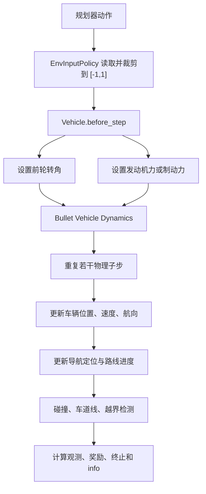

## 1. MetaDrive 环境的基本定位

MetaDrive 是一个基于 Gymnasium 接口的自动驾驶仿真器，底层使用 Panda3D/Bullet 完成车辆动力学、碰撞检测和传感器仿真。它主要支持两类场景：

* `MetaDriveEnv`：程序化生成道路、交通流和障碍物，适合强化学习和泛化测试。
* `ScenarioEnv`：加载 Waymo、nuScenes 等真实驾驶数据构建场景。

下面主要讨论程序化的 `MetaDriveEnv`。其标准交互形式为：

```python
obs, info = env.reset(seed=0)

obs, reward, terminated, truncated, info = env.step(action)
```

MetaDrive 同时支持单智能体、多智能体、激光雷达、RGB/深度/语义图像、俯视图和车辆物理仿真。

从系统结构看，可以把它理解为：

```text
地图管理器 ── 生成道路拓扑和道路几何
交通管理器 ── 生成并控制背景交通
智能体管理器 ── 管理自车、策略、观测和动作
物理引擎 ── 根据转向、驱动力、制动力推进车辆
传感器 ── 生成激光雷达、图像和道路检测结果
环境接口 ── 计算 observation、reward、done、info
```

---

## 2. 如何接入规划智能体

最简单的接入形式是将规划器放在环境循环外部：

```python
from metadrive.envs.metadrive_env import MetaDriveEnv

env = MetaDriveEnv(
    {
        "use_render": False,
        "map": 6,
        "num_scenarios": 100,
        "traffic_density": 0.15,
    }
)

obs, info = env.reset(seed=0)

while True:
    planner_input = build_planner_input(env, obs)

    planned_trajectory = planner(planner_input)

    # 将规划轨迹转成 MetaDrive 的底层控制量
    action = trajectory_tracker(planned_trajectory, env.agent)

    obs, reward, terminated, truncated, info = env.step(action)

    if terminated or truncated:
        break

env.close()
```

这里要注意：**MetaDrive 默认不直接接收未来轨迹，而是接收车辆控制量。**

因此完整链路通常是：

```text
MetaDrive 场景状态
        ↓
场景特征构造
        ↓
扩散规划器输出未来轨迹
        ↓
轨迹跟踪控制器
        ↓
[转向, 油门/制动]
        ↓
MetaDrive 车辆动力学
```

这与你当前的 Diffusion Planner 存在一个接口差异：Diffusion Planner 生成的是自车及邻车未来轨迹，而 MetaDrive 默认动作是低层控制量。

### 三种接入方式

**方式一：规划器直接输出控制量。**

把扩散模型的输出改成未来控制序列：

[
\mathbf u_{0:T}
===============

[(\delta_0,a_0),\ldots,(\delta_T,a_T)]
]

每次只执行第一个控制：

```python
control_sequence = planner(scene)
action = control_sequence[0]
env.step(action)
```

实现最直接，但需要改变 Diffusion Planner 的轨迹输出定义，不建议作为第一步。

**方式二：规划器输出轨迹，再进行轨迹跟踪。**

保持扩散模型输出：

[
\tau =
[(x_1,y_1,\psi_1),\ldots,(x_T,y_T,\psi_T)]
]

使用 Pure Pursuit、Stanley、LQR 或 MPC 将轨迹转换为：

[
[\text{steering},\text{throttle/brake}]
]

这是最适合当前项目的方式，因为可以基本保留 Diffusion Planner 的生成结构。

**方式三：自定义 MetaDrive Policy。**

MetaDrive 的 `agent_policy` 默认是 `EnvInputPolicy`，也可以替换为自定义类。自定义 policy 可以直接接收轨迹，在内部调用跟踪控制器，然后返回二维控制量。环境配置本身已经为 `agent_policy` 和 `agent_observation` 预留了替换接口。

对于初期实验，建议先采用方式二，不必修改 MetaDrive 内部代码。

---

## 3. 智能体可以获得什么道路信息

MetaDrive 提供两个层级的道路信息。

### 3.1 默认观测中的压缩道路信息

默认非图像观测是 `LidarStateObservation`，由三部分构成：

```text
车辆状态
+ 导航信息
+ 激光雷达
```

默认配置下大约是一个 259 维向量：

[
9\text{维车辆/车道状态}
+
10\text{维导航信息}
+
240\text{维激光雷达}
]

其中道路相关内容包括：

* 到左右道路边界的距离；
* 自车航向与当前参考车道航向之差；
* 当前车道横向偏移；
* 当前和下一段导航检查点的相对位置；
* 当前和下一段车道的曲率描述；
* 顺时针或逆时针转弯标志；
* 转弯角度；
* 车道线检测结果，可选；
* 道路边缘检测结果，可选。

导航信息由两个检查点组成，每个检查点对应五维信息：

[
[x_{\mathrm{rel}},y_{\mathrm{rel}},r,\mathrm{clockwise},\Delta\psi]
]

因此一共是十维。

默认观测适合普通强化学习策略，但对扩散轨迹规划器而言信息不够完整，因为它没有直接提供：

* 完整车道中心线；
* 车道拓扑图；
* 多段路线几何；
* 邻车历史轨迹；
* 可变长度的地图元素。

这些需要自行构造。

---

### 3.2 完整矢量道路信息

程序化地图内部维护一个 `NodeRoadNetwork`。道路网络表示为：

```python
graph[start_node][end_node] = [lane_0, lane_1, ...]
```

其中：

* 图节点表示道路段连接点；
* 图边表示一段 road；
* 每条图边包含一条或多条 lane。

可以直接调用：

```python
map_features = env.current_map.get_map_features(interval=1.0)
```

返回的每条车道包含：

```python
{
    "polyline": ...,  # 车道中心线离散点
    "polygon": ...,  # 车道可行驶区域多边形
    "left_neighbors": ...,  # 左侧相邻车道
    "right_neighbors": ...,  # 右侧相邻车道
    "entry": ...,  # 前驱连接
    "exit": ...,  # 后继连接
    "type": ...,  # 车道类型
    "speed_limit_kmh": ...,  # 限速
}
```

这是最适合构造 Diffusion Planner 地图输入的接口。

单个 lane 对象还提供：

```python
lane.position(longitudinal, lateral)
lane.local_coordinates(world_position)
lane.heading_theta_at(longitudinal)
lane.width_at(longitudinal)
lane.get_polyline(interval)
lane.polygon
lane.speed_limit
lane.length
lane.index
```

因此可以计算：

* 车道中心线；
* 左右边界；
* 航向角；
* 曲率；
* 车道宽度；
* 纵向位置；
* 横向偏移；
* 限速；
* 相邻车道和连接关系。

道路边界线还可以通过：

```python
boundary_features = env.current_map.get_boundary_line_vector(interval=1.0)
```

得到：

* 边界线 polyline；
* 实线、虚线、黄色线、白色线等类型；
* 对应车道限速。

---

### 3.3 路线信息

自车的导航模块可以提供：

```python
vehicle = env.agent
navigation = vehicle.navigation

navigation.checkpoints
navigation.current_ref_lanes
navigation.next_ref_lanes
navigation.current_road
navigation.next_road
navigation.final_lane
navigation.route_completion
navigation.total_length
navigation.travelled_length
```

路线由道路图上的最短路径产生。`checkpoints` 是路线经过的图节点序列，`current_ref_lanes` 和 `next_ref_lanes` 分别给出当前及下一道路段上的候选车道。

对于扩散规划器，建议分别构造：

```text
普通地图车道：自车周围一定半径内的所有车道
路线车道：checkpoints 对应道路段中的车道
```

这与 Diffusion Planner 区分普通 `lanes` 和 `route_lanes` 的设计基本一致。

---

## 4. 推荐传给扩散规划器的道路输入

不要直接把 `get_map_features()` 返回的可变长度字典输入网络。应当筛选、重采样、坐标转换并填充成固定维度。

当前官方 checkpoint 的固定格式为：

```text
lanes:                        [B, 70, 20, 12]
lanes_speed_limit:            [B, 70, 1]
lanes_has_speed_limit:        [B, 70, 1]
route_lanes:                  [B, 25, 20, 12]
route_lanes_speed_limit:      [B, 25, 1]
route_lanes_has_speed_limit:  [B, 25, 1]
```

单点的 12 个通道顺序必须与预训练实现一致：

```text
[center_x, center_y,
 delta_x, delta_y,
 left_boundary_dx, left_boundary_dy,
 right_boundary_dx, right_boundary_dy,
 traffic_green, traffic_yellow, traffic_red, traffic_unknown]
```

这些是当前 ego 后轴坐标系中的原始、未归一化量。MetaDrive 程序化地图没有可靠的
交通灯状态，因此有效 lane 显式使用 unknown `[0, 0, 0, 1]`。无效 lane 保持全零；模型通过
全零 padding 判定有效性，不额外接收 `lane_mask` 或 `route_mask`。

处理流程建议为：

```text
完整道路网络
  ↓
以自车为中心按距离筛选
  ↓
按车道中心线距离排序
  ↓
每条车道沿完整弧长均匀重采样 20 点
  ↓
转换至自车局部坐标系
  ↓
截断和零填充
  ↓
截断为 70/25 条并严格零填充
```

`MetaDriveMapAdapter` 使用 `navigation.checkpoints` 的连续 road edge 识别 route lane，并将
`lane.speed_limit` 从 km/h 转换为 m/s。Adapter 只构造原始张量，归一化仍由
`PretrainedDiffusionPlanner` 负责。

需要特别注意：MetaDrive 程序化道路主要是二维车道几何。`get_map_features()` 原生没有道路坡度或高程预瞄。对于能耗优化，需要自行扩展：

```text
grade / slope
elevation
road friction
recommended speed
traffic signal timing
energy cost profile
```

其中限速和曲率可以从 MetaDrive 原生地图获取，坡度和高程需要额外定义。

---

## 5. 智能体应输出什么动作

### 5.1 默认连续动作

默认动作空间是：

```python
gym.spaces.Box(low=-1.0, high=1.0, shape=(2,))
```

动作定义为：

```python
action = [steering, throttle_brake]
```

即：

[
a =
[\delta,u]
]

其中：

* `action[0]`：归一化转向，范围 ([-1,1])；
* `action[1]`：归一化油门/制动，范围 ([-1,1])。

语义为：

```text
steering < 0：一个方向转向
steering > 0：另一个方向转向

throttle_brake > 0：施加驱动力
throttle_brake < 0：施加制动力
```

默认不允许倒车，因此车辆静止时给负值主要表示制动，而不是反向驱动。也可以通过 `enable_reverse=True` 开启倒车。

转向控制最终转换为：

[
\delta_{\mathrm{wheel}}
=======================

\delta_{\mathrm{normalized}}\delta_{\max}
]

正油门对应发动机力，负油门对应制动力。

MetaDrive 也支持：

* `Discrete`；
* `MultiDiscrete`；
* 多智能体字典动作。

但轨迹规划实验建议保持连续动作。

---

### 5.2 扩散规划器推荐输出

建议扩散模型继续输出：

```text
[T, 3] = [x, y, heading]
```

或者：

```text
[T, 4] = [x, y, cos(heading), sin(heading)]
```

然后由跟踪控制器输出 MetaDrive 动作：

```python
trajectory = diffusion_planner(scene)

steering = lateral_controller(ego_state, trajectory)

throttle_brake = longitudinal_controller(ego_state, trajectory)

action = [np.clip(steering, -1, 1), np.clip(throttle_brake, -1, 1)]
```

推荐控制器组合：

```text
横向：Pure Pursuit / Stanley / LQR
纵向：PID / MPC
```

对于能耗优化，最好采用带加速度、加加速度和动力约束的 MPC，因为简单 PID 会削弱规划轨迹中的节能速度特征。

---

### 5.3 当前阶段实现的运动学轨迹接口

当前阶段使用 `TrajectoryMetaDriveEnv` 和 `KinematicTrajectoryPolicy` 验证模型坐标及闭环接口。
公开动作是完整的 `float32 [80, 4]` 轨迹：

```text
[x, y, cos(relative_heading), sin(relative_heading)]
```

轨迹以规划时刻 ego 后轴为原点，x 向前、y 向左。一次高层 `env.step(trajectory)` 在内部执行
5 个 0.1 s 子步并汇总奖励，即每 0.5 s 重规划。Policy 将后轴轨迹转换为 MetaDrive 车辆中心
轨迹，直接更新位置、速度、航向和角速度；它不会生成 steering/throttle，因此属于运动学闭环，
不用于验证低层动力学可执行性。

---

## 6. 环境如何根据动作改变

默认 `EnvInputPolicy` 的一次 `env.step(action)` 执行过程如下；自定义运动学轨迹 Policy 不经过
下面的转向和油门链路：



具体调用链是：

```text
env.step(action)
  └─ BaseEnv._preprocess_actions()
  └─ engine.before_step()
       └─ AgentManager
            └─ policy.act()
            └─ vehicle.before_step(action)
  └─ engine.step(decision_repeat)
       └─ managers.step()
       └─ Bullet physics step
  └─ engine.after_step()
       └─ vehicle.after_step()
            ├─ navigation.update_localization()
            ├─ collision check
            ├─ road-boundary check
            └─ energy calculation
  └─ observation / reward / done
```

默认物理步长是：

[
\Delta t_{\mathrm{physics}}=0.02\text{ s}
]

每个环境动作重复五个物理步：

[
\text{decision_repeat}=5
]

因此：

[
\Delta t_{\mathrm{env}}
=======================

# 0.02\times5

0.1\text{ s}
]

即默认决策频率为 10 Hz。

这与 Diffusion Planner 使用的 10 Hz 轨迹频率一致。若保留默认 MetaDrive 配置，则 80 个未来轨迹点正好对应 8 秒，不需要时间重采样。

---

## 7. 地图如何构建

### 7.1 程序化 Block 拼接

`MetaDriveEnv` 默认使用 `PGMap`。地图不是从一张栅格图生成，而是由多个参数化道路块 `PGBlock` 顺序拼接。

典型道路块包括：

* Straight；
* Curve；
* Intersection；
* T-Intersection；
* Roundabout；
* In-ramp；
* Out-ramp；
* Merge；
* Split；
* Parking lot；
* Toll gate。

默认随机分布主要启用直道、弯道、十字路口、T 型路口、环岛和上下匝道。

配置：

```python
config = {
    "map": 5,
    "map_config": {
        "lane_width": 3.5,
        "lane_num": 3,
        "exit_length": 50,
        "start_position": [0, 0],
    },
}
```

当 `map` 是整数时，表示随机生成指定数量的后续道路 block。生成器内部还会先构造一个 `FirstPGBlock`。

当 `map` 是字符串时，字符串表示指定的 block 序列：

```python
config = {"map": "SCr..."}
```

具体字符由对应 block 的 `ID` 定义。

生成过程为：

1. 构造初始道路块；
2. 从概率分布中采样下一种 block；
3. 随机选择上一个 block 的出口 socket；
4. 将新 block 接到该 socket；
5. 检查道路是否发生几何冲突；
6. 检查车道数是否合法；
7. 若失败则重新采样参数；
8. 多次失败时回溯到前一个 block；
9. 最终将所有车道加入全局道路图。

### 7.2 地图随机种子

地图由环境 seed 控制：

```python
obs, info = env.reset(seed=10)
```

相同配置和相同 seed 会生成相同地图。`PGMapManager` 会按 seed 管理地图，并在 `store_map=True` 时缓存已生成地图。

这非常适合训练/测试划分：

```text
训练：seed 0–999
验证：seed 1000–1099
测试：seed 1100–1299
```

### 7.3 路网与路线

地图生成结束后形成 `NodeRoadNetwork`：

```text
道路节点 → 道路段 → 车道列表
```

导航模块根据起点和终点在图上搜索最短节点路径，并生成自车路线。每条 lane 同时参与：

* 车辆定位；
* 路线规划；
* 道路边界生成；
* 碰撞与越界判断；
* 地图矢量特征导出。

---

## 8. 面向 Diffusion Planner 的推荐接口

当前环境适配接口为：

```text
MetaDrive
  │
  ├─ 自车状态与历史
  ├─ 背景车辆状态与历史
  ├─ 局部矢量地图
  ├─ 导航路线
  ├─ 后轴局部矢量地图 [70, 20, 12]
  └─ 导航路线车道 [25, 20, 12]
          ↓
Diffusion Planner
          ↓
未来 8 秒轨迹 [80, 4]
          ↓
KinematicTrajectoryPolicy
          ↓
执行前 5 点
          ↓
推进 0.5 秒
          ↓
重新观测和规划
```

地图部分通过以下接口构造：

```python
adapter = MetaDriveMapAdapter(model_config, query_radius_m=100.0)
map_input = adapter.build(env, device)

obs, reward, terminated, truncated, info = env.step(trajectory)
```

当前另有严格限定为无交通场景的 `NoTrafficMetaDriveObservationAdapter`。它组合地图输入、官方
推理 ego 当前状态和真实的无对象 padding，并会拒绝非零交通配置以及 reset 后出现的背景车辆或
静态交通物体。该接口已用于官方权重的直道/缓弯闭环，但不代表完整
`MetaDriveObservationAdapter` 已完成；邻车 21 帧历史和低密度交通仍将在后续阶段补齐。

---

## 9. MetaDrive 的能耗信息

MetaDrive 车辆在 `after_step()` 中会计算并返回：

```python
info["step_energy"]
info["episode_energy"]
```

其内置公式大致为：

[
E_{\mathrm{step}}
=================

3.25
e^{0.01v_{\mathrm{km/h}}}
\frac{\Delta s_{\mathrm{km}}}{100}
\times1000
]

返回值实际更接近以毫升表示的燃油消耗代理量。

可以在环境外修改奖励：

```python
obs, base_reward, terminated, truncated, info = env.step(action)

energy_reward = -energy_weight * info["step_energy"]

reward = base_reward + energy_reward
```

但该模型只使用速度和行驶距离，没有显式考虑：

* 加速度；
* 车辆质量；
* 滚动阻力；
* 空气阻力；
* 道路坡度；
* 传动效率；
* 电机效率；
* 再生制动；
* 辅助系统功耗。

因此适合做早期相对比较，不适合作为高可信度能耗模型。

对于你的研究，更合理的做法是保留 MetaDrive 的交通、地图和车辆交互，但替换能耗计算为：

[
F_{\mathrm{traction}}
=====================

ma
+
mgC_r
+
\frac{1}{2}\rho C_dA v^2
+
mg\sin\theta
]

[
P_{\mathrm{wheel}}
==================

F_{\mathrm{traction}}v
]

再结合动力系统效率和再生制动计算电池或燃油能耗。

总体上，MetaDrive 很适合用作扩散规划器的闭环交通环境；需要补充的主要接口是：**完整矢量地图构造、邻车历史缓存、轨迹跟踪控制器，以及更可信的车辆能耗模型。**
