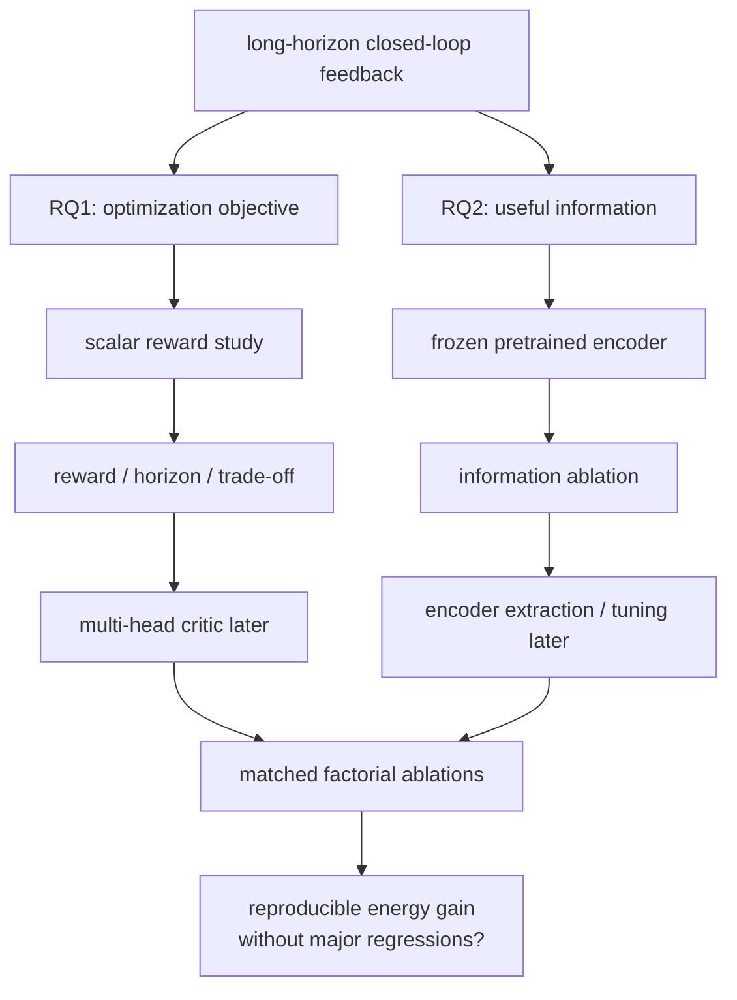

# 研究空间

本目录只保存尚未成为系统事实、正式决定或 active implementation work 的研究内容。

文档职责：

- 当前已实现行为 → [`docs/agents/system-contract.md`](../agents/system-contract.md)
- 已接受的技术决定及理由 → [`docs/adr/`](../adr/)
- 可执行开发工作 → GitHub Issues
- 实验运行证据 → [`docs/experiments/`](../experiments/)
- 外部论文和代码事实 → 对应 primary-source notes
- 尚未解决的研究问题与实验设计 → 本目录

## 核心研究问题

> **如何利用闭环长程反馈优化自动驾驶规划器的能耗表现，同时避免安全、有效进度、平均速度和旅行效率出现不可接受的退化。**

该问题拆成两个相互独立但最终需要联合验证的研究方向：

1. **Optimization objective：奖励与价值估计应如何设计？**  
   当前先研究单一标量 reward 的结构、尺度与时间信用分配；在获得稳定且可解释的能耗优化信号后，再考虑多头 critic、约束式目标或其他 multi-objective 方法。

2. **Information：策略需要哪些环境信息？**  
   当前暂借用 Diffusion Planner 预训练得到的 scene representation，先判断不同信息是否对长程节能策略具有增量价值；之后再将相关感知/编码模块显式提取出来，并研究在强化学习过程中冻结、部分微调或联合优化的差异。

## 研究结构

详细研究设计：

- [Reward and objective study](reward-objective.md)
- [Information and representation study](information-representation.md)
- [Ablation plan](ablation-plan.md)
- [PlannerRFT PPO-only method notes](plannerrft-ppo/README.md)

## 当前实验基础

截至 2026-09-01，项目已经具备研究上述问题所需的主要实验基础：

- MetaDrive 闭环执行、固定 scenario/seed 对照和可追溯 evaluation artifact；
- 预训练 Diffusion Planner 的冻结推理、reference trajectory 和 orthogonal guidance；
- Exploration Policy、closed-loop rollout、GAE/PPO update 和训练产物；
- 稳定能耗场景矩阵与 execution-trace proxy energy；
- `plannerrft_energy_v1` 标量能耗 reward 和严格匹配的 reward A/B 工作流；
- PPO 稳定性搜索工作流，以及在受限 no-traffic S/SC 条件下通过 3 seeds × 100 updates 验证的稳定候选配置。

相关证据：

- [`E-019 MetaDrive native energy proxy comparison`](../experiments/records/e-019-metadrive-native-energy-proxy-comparison.md)
- [`E-026 PPO reward A/B short trend`](../experiments/records/e-026-issue59-stage-b-ppo-reward-ab-short-trend.md)
- [`E-028 PPO stability search`](../experiments/records/e-028-issue76-ppo-stability-search.md)

## 当前研究阶段

### Phase A — Experimental baseline

目标是建立可信的闭环优化与能耗评价基础。

当前状态：**基本完成。**

已有 mechanical validity 和受限条件下的 optimization stability，可以开始 reward 与 information 的研究实验。

### Phase B — Scalar reward study

目标是回答：

> 哪种单一标量 reward 能够产生可重复的能耗改善，同时不通过停车、少走、明显降速或增加失败率获得表面收益？

重点比较 reward composition、energy normalization、目标权重和长程 credit assignment。研究对象见 [`reward-objective.md`](reward-objective.md)。

### Phase C — Information study

目标是回答：

> 在相同 reward 与优化器下，哪些 observation 信息会给策略带来额外的能耗优化能力？

第一阶段固定预训练 scene encoder，只改变可用信息；道路/导航预瞄是其中一类候选，而不是预设结论。研究对象见 [`information-representation.md`](information-representation.md)。

### Phase D — Representation and objective extensions

只有在前两个阶段已经观察到明确的 behavioral / energy signal 后，再扩展：

- scalar critic → multi-head critic / constrained objective；
- frozen pretrained encoder → extracted RL encoder → partial/joint fine-tuning。

这些扩展用于判断 reward decomposition 和 representation adaptation 是否能进一步扩大已经存在的收益，而不是在没有基础信号时同时增加系统复杂度。

### Phase E — Joint ablations

最后使用少量代表配置做 `objective × information × representation` 交叉实验，判断：

- reward 改善是否依赖特定信息；
- 新信息是否只有在能耗导向长程反馈下才有价值；
- representation fine-tuning 是否提供独立增益；
- 能耗收益是否跨 seed、场景和 termination type 保持。

详细矩阵原则见 [`ablation-plan.md`](ablation-plan.md)。

## 统一评价原则

研究结论优先来自 reward-independent、matched closed-loop evaluation，而不是 training return。

至少同时报告：

- energy / energy intensity；
- route progress / completion；
- mean speed / travel efficiency；
- collision / out-of-road / wrong-direction 等安全与合法性指标；
- 必要时的 comfort 指标。

低 total energy 不能在以下条件下被解释为优化成功：

- 明显少走；
- 长时间停车；
- 平均速度或旅行效率严重下降；
- collision / out-of-road / failed termination 增加。

MetaDrive native `step_energy / episode_energy` 与当前 kinematic waypoint execution 的 phase boundary 不匹配；当前研究使用 execution boundary 重算的 proxy energy，只用于固定仿真条件下的相对比较。更精细的车辆能耗模型属于后续 robustness validation，不改变当前 reward/information 两条主线。

## 研究证据层级

为避免把工程可运行性误写成算法效果，本项目区分：

1. **mechanical validity**：rollout、reward、artifact、GAE、loss 和梯度链路正确运行；
2. **optimization stability**：多 seed、足够训练长度下策略不出现明显数值或行为崩溃；
3. **behavioral effect**：learned policy 相比初始策略产生稳定、可解释的闭环行为变化；
4. **energy effect**：reward-independent matched evaluation 中能耗改善，且其他关键指标无不可接受退化；
5. **information contribution**：严格 information ablation 表明某类环境信息提供独立增益；
6. **representation contribution**：同一信息条件下，representation fine-tuning 比 frozen encoder 提供独立增益；
7. **energy-model robustness**：proxy 下的主要策略排序在更精细能耗模型下方向一致。

当前项目已较好覆盖第 1 层，并在受限 PPO 配置上获得第 2 层证据；第 3 层以后是当前研究重点。

## 当前开放问题

当前开放问题收敛为：

- scalar reward 中 energy、安全、进度、速度与舒适性应如何组合；
- energy signal 应使用 total、distance-normalized、progress-normalized 或 reference-relative 形式中的哪一种；
- 长程 GAE/return 相比短程反馈是否真正提供额外能耗优化能力；
- 在其他指标允许的退化范围内，energy objective 的可达 trade-off 是什么；
- 仅依赖 ego state + reference trajectory 时，Exploration Policy 能学到多少节能行为；
- local lanes、route、road preview、speed-limit changes、traffic information 等分别提供多少增量价值；
- 预训练 scene encoder 对 energy-oriented RL 是否足够，还是需要在 RL 过程中适配 representation；
- multi-head critic 是否能比单一 scalar critic 更稳定地处理 energy 与其他目标的冲突；
- proxy-energy 下的主要结论能否在更精细能耗模型中保持。

可执行工作一旦被接受，应转入 GitHub Issue；本目录只维护研究问题、实验逻辑和结论边界。
