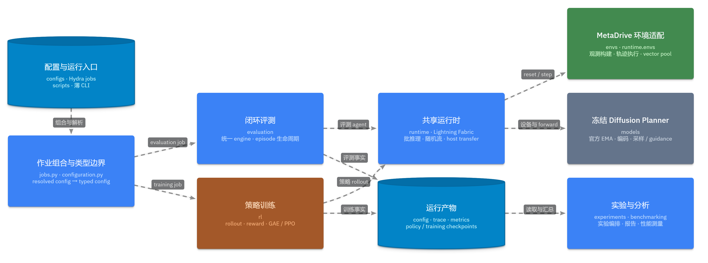
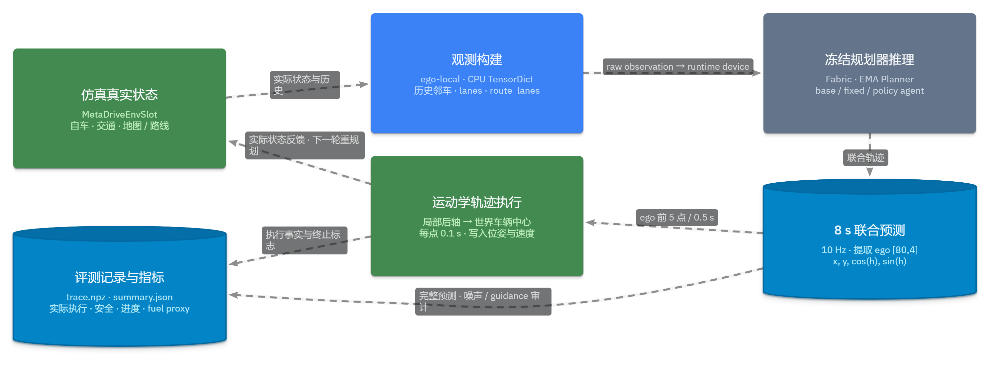

# 基于强化学习的能耗优化方式探索

**核心目标：** 自动驾驶规划器在保证正常通行与安全的前提下，生成**更节能的驾驶轨迹**。

**研究方向：**

- 能否通过energy-based classifier guidance 的方式控制模型的能耗表现；
- 能否使用PPO优化长程能耗表现（应使用何种奖励形式）；
- 如何为guidance策略模块加入车动力学特征，提高策略模型的泛化性，使其适用于不同车辆。

---

## 实验环境

- **基础轨迹规划器：** Diffusion Planner，参数量 6,042,628
  - 输入：场景条件（ego 当前状态、周围车辆历史、普通道路车道、静态障碍物），路线条件（导航车道、route lane geometry、目标方向约束）
  - 输出：自车轨迹与邻车轨迹
  - 可通过classifier guidance 影响降噪过程
- **仿真环境：** MetaDrive：程序化生成道路、交通流和障碍物
- **能耗指标：** 基于执行轨迹计算的代理能耗（非动力学计算得出）

---

### 能耗模型

下标 $t$ 表示一个 execution 子步，$v_t$ 为实际执行速度 m/s，$d_t$ 为实际位移 m

$$
f_t = 3.25 \cdot \exp\!\left(0.01 \cdot 3.6\, v_t\right) \cdot \frac{d_t}{1000}\cdot\frac{1}{100}\cdot 1000
= 3.25 \cdot \exp\!\left(0.036\, v_t\right) \cdot \frac{d_t}{100}
$$

**单位奖励强度（mL/km）**

$$
D_t = d_t, \qquad I_t = f_t \cdot \frac{1000}{D_t}
$$

（窗口/回合级同理：$I = \dfrac{\sum_t f_t \cdot 1000}{\sum_t d_t}$；$\sum_t d_t = 0$ 时 $I$ 未定义。）

---

### 引导量对去噪过程的控制

先由被冻结的Diffusion Planner 进行完整的降噪过程，获得参考轨迹$x^{ref}$。在第 $\tau$ 个位点，其局部切向单位向量为
$$n^\parallel=\begin{bmatrix}
\cos\psi\\
\sin\psi
\end{bmatrix},$$
垂直的单位法向量为：
$$n^\perp=\begin{bmatrix}
-\sin\psi\\
\cos\psi
\end{bmatrix}.$$
其中 $\psi$ 是参考轨迹在这一点的航向角。

---

#### 横向引导

- 横向引导量：$\eta_{\rm lat}\in(-1,1)$，控制最终轨迹相对参考轨迹进行横向方向偏移
- 横向变化目标：$d^{\rm target}=\lambda_{\rm lat}\eta_{\rm lat}$
- 当前轨迹相对于参考轨迹的横向位移：$d_\tau^{lat}=n^\perp_\tau\cdot(x_\tau-x_\tau^{ref})$

横向 energy ：

$$\Psi_{\rm lat}=\frac1T\sum_{\tau=1}^{T}\left[d_\tau^{lat}-d^{\rm target}\right]^2$$

> 惩罚当前轨迹的横向偏移与目标横向偏移之间的误差。

---

#### 纵向引导

- 纵向引导量：$\eta_{\rm lon}\in(-1,1)$ ，速度相比参考轨迹变化一定比例
- 速度变化目标：$v^{\rm target}_{\tau}=\lambda_{\rm lon}\eta_{\rm lon}\,v^{ref}_{\parallel}(\tau)$

纵向 energy：

$$\Psi_{\rm lon}=\frac1T\sum_{\tau=1}^{T}\left[n_\tau^\parallel\left(v_\tau- v^{\rm target}_{\tau}\right)\right]^2$$

---

重新进行降噪过程，在降噪过程中，通过横向引导与纵向引导改变降噪方向，获得最终轨迹。

$$\tilde s_\theta(x_s,s)=s_\theta(x_s,s)-\nabla_{x_s}E$$

其中 $s_\theta$ 是原本的 diffusion score，且
$$
E=\Psi_{\rm lat}+\Psi_{\rm lon}.
$$

---

## 项目架构

---

## 闭环仿真

---

## 轨迹生成

Diffusion Planner 主干保持冻结，额外引入 **Exploration Policy（探索策略）**：

## 强化学习

Diffusion Planner 主干保持冻结，额外引入 **Exploration Policy（探索策略）**：

1. 输入当前环境状态（直接使用主干的场景编码）；
2. 输出一个低维 **guidance（引导量）**；
3. guidance 改变 Diffusion Planner 的轨迹生成方向；
4. 车辆执行轨迹后获得奖励；
5. PPO 根据长期回报更新 Exploration Policy。

---

---

奖励形式：

$$ R_{\lambda} = Gate \times (5 TTC + 5 Progress + 2 Comfort + 4 Speed + \lambda  Energy) / (16 +  \lambda)$$

其中，能耗指标计算方式为：

$$ Energy = \mathrm{clip}\!\left(\dfrac{I_{\mathrm{zero}} - I_t}{I_{\mathrm{zero}} - I_{\mathrm{full}}},\,0,\,1\right) $$

(为保持与其他奖励项相同的尺度，进行归一化处理，$I_{\mathrm{zero}}$, $I_{\mathrm{full}}$通过实验测得)

---

### 引导策略模块

- 输入：主干模型的原始轨迹、场景编码token、导航 token（分别来自 Diffusion Planner 的 Scene Encoder 与 Route Encoder）
- 网络结构：先通过线性模块提取信息，再通过交叉注意力进行信息融合，最后通过线性模块输出Actor 与 Critic 两个 head。
- Actor 输出 两组 Beta distribution 参数：$(\alpha_{\rm lat},\beta_{\rm lat}),\ (\alpha_{\rm lon},\beta_{\rm lon}).$
然后通过采样获得引导量：
$$
\begin{aligned}
\eta_{\rm lat} &\sim\operatorname{Beta}(\alpha_{\rm lat},\beta_{\rm lat}), \\
\eta_{\rm lon} &\sim\operatorname{Beta}(\alpha_{\rm lon},\beta_{\rm lon}).
\end{aligned}
$$
---

# 项目进展

---

## 早期实验结果

直接使用奖励与PPO进行训练，发现：

- 取 $\lambda = \{ 0, 1,2,4,8 \}$ 训练后几乎与冻结模型一致，没有可测行为差异；
- PPO 的 KL、policy ratio、guidance shift 都非常小。

进一步分析发现：

- **奖励目标本身不可辨识**：不同 $\lambda$ 对 actor gradient 的方向几乎相同；
- **PPO 更新过弱**：即使有信号，策略参数也几乎没有移动。

## 诊断过程

1. 目标函数是否可辨识？
2. PPO 是否能产生稳定、非平凡的更新？
3. guidance 是否真的能控制轨迹？

---

### 定位 reward / advantage / gradient 共线问题

原能耗分数在当前数据范围内变化过窄，导致即使使用极大的能耗奖励的权重，其与能耗奖励为0 的 actor 梯度几乎共线。

将原来的能耗表示，通过**增加裁剪操作，替换为非仿射的**，最终能耗目标在实际 PPO 更新后能够形成新的优化方向。

关键变化：

- normalized advantage 相关性明显下降；
- advantage 开始出现较明显的符号变化；
- actor gradient 不再近乎完全平行；
- `λ=64` 已能达到较大的 gradient angular separation。

---

随后在此奖励下，搜索出有效PPO更新超参数区域，在最优情况下：

- policy ratio 不再完全等于 1；
- Monte-Carlo KL 可测；
- guidance probe 有明确变化；
- Beta 分布保持数值稳定；
- 没有 collision / OOR / 非法 action collapse。

但仍保留一个限制：

> critic 的 explained variance 仍接近 0，说明价值函数尚未明显拟合，因此“训练是否充分收敛”仍需继续检查。

---

### 能耗优化方向错误

重新比对 $\lambda=\{0, 64\}$ 的训练结果：

- 两个训练 seed 都学出了不同的 guidance；
- 两个训练 seed 都产生了可重复的闭环行为差异；
- 没有出现 collision / OOR / episode collapse。

---

## Held-out 结果

| seed | Δ speed (rel) | Δ energy (rel) | Δ route (rel) |
| --- | ---: | ---: | ---: |
| 0 | +0.1061 m/s（+1.06%） | +0.1903 mL/km（+0.41%） | +0.00238（+0.25%） |
| 1 | +0.1398 m/s（+1.41%） | +0.2496 mL/km（+0.53%） | +0.00093（+0.10%） |

**更强调 Energy 的策略反而更快，而且单位里程能耗更高。**

---
### guidance 控制效果

直接对冻结 planner 人工施加纵向引导。观察到：

> 正纵向引导量会增加整体预测轨迹的平均速度。但在第一个 waypoint 的位置却多数比原先更后。

并且由于每次虽然规划了 8 秒的轨迹，却仅执行第 1 个 0.1 s waypoint，之后立刻重新规划，所以在实际运行中，反而会降低平均速度。

---

---

## 当前问题分析

虽然 guidance 控制方向不符合预期，但至少能产生稳定的控制效果，为何PPO 往相反的方向优化？

比对 $\lambda=\{0, 64\}$ 中学到的 guidance 差异，发现横向的变化打印纵向的变化：

| seed | Δg_lon | Δg_lat | 
| --- | ---: | ---: | 
| 0 | +0.025 | +0.084 | 
| 1 | +0.024 | +0.115 | 

因此，纵向引导效果反向可能是重要机制，但不能单独解释全部现象。之后经过 6 次随机实验，都出现了此现象，排除了偶然性。所以，需要同时考虑：

> 纵向时间响应+ 横向 guidance 影响+ 两者的非线性交互

---

# 可能的原因

- 训练还没有充分收敛，虽然现在方向错误训练，但更久后可以逐渐转向正确方向
- guidance 的时间响应与闭环执行方式错位
- 纵向与横向 guidance 耦合，横向变化可能通过曲率、路径长度、速度或轨迹几何间接影响能耗。

---

## 深入分析 guidance 控制效果

1. 继续使用人工注入固定的 guidance，只改变执行轨迹的时间，观察闭环效果；
2. 人为注入不同的纵向与横向 guidance ，分析当前“更快、更耗能”到底主要由纵向、横向，还是二者耦合造成？
3. 对比闭环仿真中，每次重规划循环的轨迹点，检查“正向效果是否一直被推迟”

---

## 训练不充分诊断

若上一步的因果实验不能充分解释现象，则分析是否是训练预算不足：
1. 比较标准 GAE 与 reward-to-go 的 actor 梯度方向是否显著变化
    - 如果几乎一致，则 critic 尚未拟合可能不是错误方向的首要原因。
    - 如果差异很大，再进入 critic / temporal-credit 专项研究
2. 保持其他超参不变，逐步增加PPO更新次数：
    - 错误方向持续增强    → 基本排除“只是训练不够”
    - 后期发生符号翻转    → 支持当前训练预算不足
    - 方向频繁震荡        → 更像 optimization instability

---

# 当前可以确认的内容

- 能耗目标经过重新表示后，可以形成可辨识的 actor optimization direction；
- guidance 对冻结 Diffusion Planner 与闭环行为有真实控制作用；
- 标准 PPO 已找到稳定、可测的有效更新区域；
- R0 与 Rstress 可以学出稳定、可重复的不同策略；
- “更快、更耗能”的现象在多个 seed 与 stochastic evaluation 中可复现；
- full-horizon planner response 与 first-waypoint executed response 存在明显时间方向差异。

---

# 更进一步方向

- 使用发动机油耗模型，获取更精准的指标
- 在策略模块中加入车辆动力学特征，提高其泛化性，以便后续用于不同的车辆。